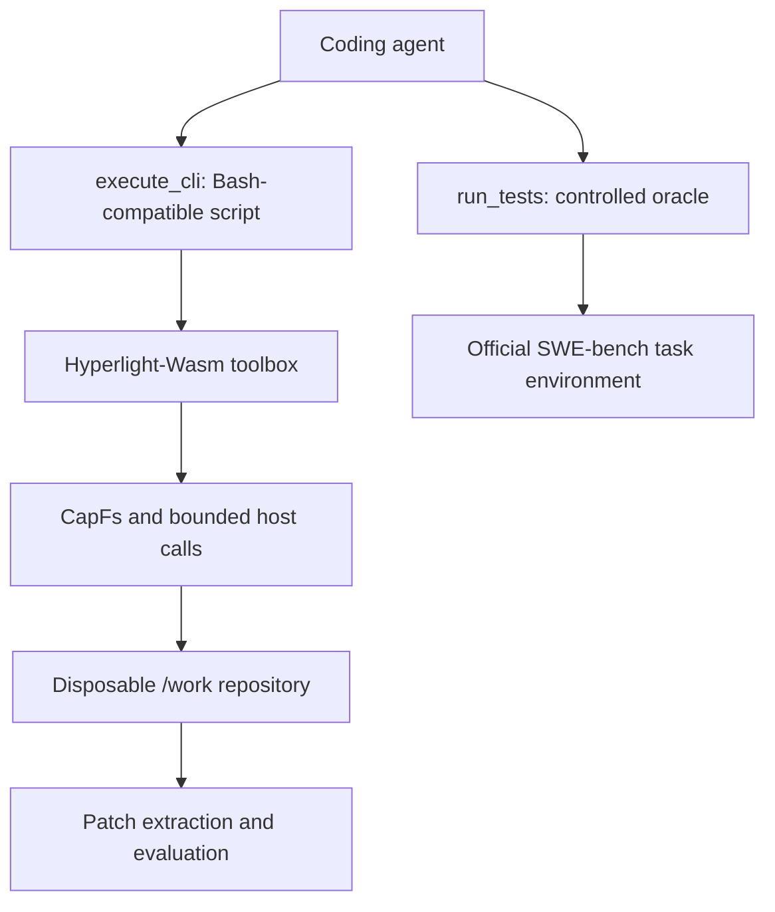

# Hyperlight-Wasm toolbox for SWE-bench agents

## 1. Research objective

The immediate goal is not to reproduce a complete Linux userspace. It is to build the smallest credible system that can run coding-agent interactions over real SWE-bench repositories while preserving the Hyperlight-Wasm isolation boundary.

The system must support three things:

1. A coding agent can inspect, search, edit, and reorganize a repository using familiar Bash-style command strings.
2. The same tool workload can run through multiple isolation backends so their overheads can be compared fairly.
3. The implementation exposes enough instrumentation to explain overheads such as VM exits, page faults, dTLB misses, memory growth, host calls, and snapshot costs.

SWE-bench is the workload source and correctness oracle. The initial contribution is systems characterization, not a new agent leaderboard score.

## 2. Executive decision: Bash-compatible interface, Wasm-native execution

Implement a **bounded Bash-compatible shell subset inside the toolbox Wasm component**.

The agent may submit commands such as:

```bash
grep -R "old_name" src tests | head -50
sed -n '120,190p' src/module.py
cp src/module.py /tmp/module.py.bak
git diff -- src/module.py
```

The shell parser and supported commands execute as code compiled into the Wasm guest. The host must not implement `execute_cli` by invoking `bash`, `sh`, `subprocess`, `fork`, `exec`, or an arbitrary host binary.

This is intentionally different from shipping literal GNU Bash:

- GNU Bash expects process creation, executable loading, signals, and a Unix environment that the current component model does not provide.
- A Wasm-native interpreter can implement the syntax and commands coding agents actually use while retaining bounded execution and a small attack surface.
- Unsupported commands are logged. Real workload traces determine what is added next.

If later experiments show that literal Bash or arbitrary repository toolchains are necessary, treat that as a separate architecture and research branch, not a hidden fallback in this MVP.

## 3. System boundary



The MVP separates two trust domains:

- **Agent file-tool execution:** runs inside Hyperlight-Wasm and is the main object of measurement.
- **Repository test execution:** runs through a controlled test oracle, initially the official SWE-bench Docker environment. The model cannot supply an arbitrary host command to this oracle.

This separation allows broad SWE-bench coverage without pretending that arbitrary project interpreters, compilers, and native dependencies already run inside Hyperlight-Wasm.

Claims and results must state this boundary clearly. A run is not “fully contained in Hyperlight” when its test oracle executes elsewhere.

## 4. Mount and lifecycle model

| Guest path | Access | Lifetime | Cleared before run | Purpose |
|---|---|---|---:|---|
| `/input` | Read-only | Sandbox | No | Immutable inputs |
| `/output` | Read-write | Per run | Yes | Collected ephemeral output |
| `/work` | Read-only by default; explicit read-write for agents | Task | No | Disposable repository |
| `/tmp` | Read-write | Per run | Yes | Shell spill files and temporary data |

Required invariants:

- Every SWE-bench task uses a disposable repository copy or worktree.
- `/work` changes persist across tool calls and runtime snapshot restore.
- `/tmp` and `/output` are recursively cleared before reuse.
- Snapshot restore does not claim to roll back host filesystem changes.
- A timed-out or panicked sandbox is discarded and recreated.
- Mount overlap is rejected after canonicalizing host paths.

## 5. Security and resource policy

The research prototype still needs hard safety boundaries because model-generated shell programs and benchmark repositories are untrusted.

Minimum controls:

- capability-relative filesystem access only;
- no parent traversal, absolute host paths, or escape through symlinks;
- explicit read/write mount permissions;
- command/script size limit;
- stdout and stderr limits;
- descriptor, stream, read, write, file-count, directory-entry, and recursion budgets;
- shell AST depth and node limits;
- pipeline-stage and expansion limits;
- cooperative deadline checks in loops and recursive commands;
- hard timeout outside the guest;
- poisoned-sandbox discard after hard timeout or runtime panic;
- network disabled by default;
- no host credentials or ambient environment variables copied into the guest.

Suggested prototype limits are starting points, not compatibility promises:

| Resource | Initial limit |
|---|---:|
| Script size | 64 KiB |
| Stdout | 1 MiB |
| Stderr | 1 MiB |
| Open descriptors | 1,024 |
| Open streams | 1,024 |
| Bytes read per invocation | 256 MiB |
| Bytes written per invocation | 64 MiB |
| Created entries | 10,000 |
| Traversal depth | 64 |
| Shell AST nodes | 10,000 |
| Pipeline stages | 32 |
| Default wall time | 5 seconds, with a host-set maximum |

## 6. Compatibility target

The shell should prioritize the commands and syntax used by coding agents. Compatibility is empirical: trace real runs, record unsupported syntax and commands, then add the highest-impact missing behavior.

### Required for the first SWE-bench pilot

| Area | Required behavior |
|---|---|
| Words | Single/double quotes, escapes, empty arguments |
| Composition | `;`, `&&`, `||`, pipelines |
| Redirection | `<`, `>`, `>>`, `2>`, `2>&1` where practical |
| Paths | Relative paths, `/work`, `/tmp`, `.` and bounded globbing |
| State | `cd`, `pwd`, local variables, `export`, `unset` |
| Expansion | `$VAR`, `${VAR}`, `$?`, command substitution after cancellation is proven |
| Tests | `test` and `[` |
| Inspection | `ls`, `cat`, `head`, `tail`, `wc`, `stat`, `find` |
| Search | `grep`, then `rg`-compatible subset |
| Editing | `sed` subset, `mkdir`, `touch`, `cp`, `mv`, `rm` |
| Changes | `diff`, `patch`, read-only `git status/diff/log/show` |
| Text utilities | `printf`, `sort`, `uniq`, `cut`, `tr`, `basename`, `dirname`, `tee` |

### Add only when traces justify them

- `for`, `while`, and `if` compound commands;
- shell functions;
- `xargs`;
- archive commands;
- JSON utilities;
- additional Git mutations;
- controlled HTTP;
- language-specific package managers or compilers.

### Explicit non-goals for the MVP

- arbitrary host binaries;
- process spawning or job control;
- unrestricted `cargo`, system Python, `pip`, `npm`, `apt`, or compiler execution;
- raw sockets;
- interactive terminal behavior;
- full GNU/POSIX bug-for-bug compatibility;
- literal GNU Bash unless evaluated as a separate design.

## 7. Optimized implementation phases

## Phase 0 — Pinning and feasibility

Keep this phase small and reproducible.

1. Pin the Hyperlight Sandbox, Hyperlight-Wasm, Hyperlight, Rust, component, and AOT revisions.
2. Preserve license notices for reused command or shell code.
3. Build a tiny component exporting `executor.run`.
4. Validate, AOT-compile, load, and invoke it through Hyperlight-Wasm.
5. Record the host kernel, virtualization backend, CPU, and relevant measurement tools.

### Exit criteria

- `echo`, `true`, `false`, and `pwd` run through an AOT component.
- The build is reproducible from a clean checkout.
- The component boundary needed by the toolbox is confirmed.

## Phase 1 — Hierarchical CapFs foundation

Implement the filesystem behavior needed by the shell:

- descriptors for both opened files and opened directories;
- operations relative to any directory descriptor;
- one typed nested-path parser used by every `*_at` operation;
- precise symlink-follow policy;
- `open_at`, `stat_at`, directory streams, create, unlink, remove-directory, rename, truncate, and bounded recursive cleanup;
- read/write/mutation permission enforcement;
- per-run filesystem budgets;
- descriptor invalidation after cleanup;
- precise WASI error mapping.

Tests must cover nested paths, `..`, absolute paths, backslashes, symlink escapes and loops, rename/unlink sequences, recursive cleanup, quotas, and read-only mounts.

### Exit criteria

- A tiny component can recursively read and modify a nested tree when authorized.
- The same mutations fail on a read-only mount.
- No accepted path reaches a sentinel outside the preopen.
- `/output` recursive cleanup is reliable.

## Phase 2 — Persistent `/work`, ephemeral `/tmp`, and SDK APIs

Add:

- persistent `/work` with explicit `ReadOnly` or `ReadWrite` access;
- owned private `/tmp` with `ClearBeforeRun` lifetime;
- mount-overlap rejection using canonicalized host paths;
- Rust builder support;
- Python SDK and backend forwarding for `work_dir`, `work_dir_access`, and `temp_dir`;
- tests for persistence, cleanup, overlap, and normalization.

Do not let guest code depend on numeric preopen descriptors; discover preopens by guest path.

### Exit criteria

- `/work` persists across calls and restore.
- `/tmp` is empty before each call.
- default `/work` access is read-only.
- Python and Rust APIs produce the same mount policy.

## Phase 2.5 — Mandatory integration and cancellation gate

This phase closes the gap between filesystem unit tests and a usable shell.

1. Build a tiny toolbox AOT component.
2. Read a nested file from `/work`.
3. Create, modify, rename, and delete a file under read-write `/work`.
4. Verify `/tmp` cleanup and `/work` persistence across two calls.
5. Run a deliberately non-terminating guest invocation.
6. Terminate it within `deadline + bounded grace`.
7. Mark the old sandbox poisoned, discard it, create a fresh sandbox, and run another command.
8. Check repeated timeouts for VM, thread, descriptor, and memory leaks.

If Hyperlight-Wasm has no reliable hard-cancellation API, run each sandbox instance in a dedicated supervisor process and terminate that worker on timeout. A Rust worker thread alone is not a hard-kill mechanism.

### Exit criteria

- Nested read/write works through the complete AOT path.
- Timeout recovery is demonstrated, not assumed.
- Shell loops remain disabled until this gate passes.

## Phase 3 — Bash-compatible shell MVP

Build the first interface that an agent can actually use.

Recommended component structure:

```text
src/wasm_sandbox/guests/toolbox/
  src/
    lib.rs
    executor.rs
    context.rs
    limits.rs
    lexer.rs
    parser.rs
    ast.rs
    shell.rs
    registry.rs
    tools/
```

### 3.1 Shell core

Implement:

- POSIX-style words, quoting, and escaping;
- simple commands;
- `;`, `&&`, and `||`;
- sequential pipelines with bounded in-memory buffers and `/tmp` spill files;
- `<`, `>`, and `>>` redirection;
- cwd and a small deterministic environment;
- variable expansion and `$?`;
- bounded glob expansion;
- consistent exit codes;
- output truncation markers;
- one deadline and budget shared by the entire script.

Do not dispatch through host processes. Every command name resolves through a guest registry.

### 3.2 First command set

Implement in this order:

1. `echo`, `printf`, `true`, `false`, `pwd`, `cd`;
2. `ls`, `cat`, `head`, `tail`, `wc`;
3. `grep`, `find`, `test`, `[`;
4. `mkdir`, `touch`, `cp`, `mv`, `rm`;
5. a small deterministic file editor, preferably `sed` substitutions plus a direct whole-file replacement command.

Commands must use `ExecutionContext` for stdin, stdout, stderr, cwd, environment, deadline, and budget. Command failures return ordinary exit codes rather than panicking the host.

### 3.3 Agent-facing contract

```python
async def execute_cli(script: str) -> ToolResult:
    """Execute a bounded Bash-compatible script using Wasm-native commands."""
```

`ToolResult` should expose at least `exit_code`, `stdout`, `stderr`, `timed_out`, and `truncated`. Unknown commands return 127. There is never a fallback to host Bash.

### Exit criteria

- Representative multi-command scripts with quotes, pipelines, redirects, and conditionals work.
- An agent can inspect and edit a nested repository using only `execute_cli`.
- Read-only mounts reject mutations.
- Output floods and recursive traversals remain bounded.
- No shell syntax path reaches a host process API.

## Phase 4 — SWE-bench command coverage

Do not guess the complete command surface. Measure it.

### 4.1 Trace a pilot corpus

Run an existing Bash-capable coding agent on a small, diverse SWE-bench pilot corpus in the official environment. Record:

- command name and normalized shell construct;
- arguments category, not secrets or repository contents;
- success/failure and output bytes;
- whether the command was required to progress;
- filesystem paths and operation types;
- elapsed time.

Produce a coverage table mapping each observed operation to `supported`, `partial`, `oracle-only`, or `unsupported`.

### 4.2 Add high-value compatibility

Expected priorities are:

- `rg`-compatible recursive search;
- practical `sed -n` and substitution behavior;
- `diff` and `patch`;
- `sort`, `uniq`, `cut`, `tr`, `tee`, `basename`, and `dirname`;
- bounded command substitution;
- bounded `if` and `for` constructs if traces show they block tasks;
- read-only `git status`, `git diff`, `git log`, and `git show` through a Wasm-native library.

Git must ignore hooks, credential helpers, pagers, editors, external diff/merge programs, filters, submodule helpers, system/global configuration, and network protocols.

### 4.3 Compatibility policy

- Implement the subset observed in workloads.
- Document behavior that differs from Bash or GNU tools.
- Add every unsupported invocation to machine-readable telemetry.
- Re-run the same pilot after each command tranche.
- Stop expanding once the selected tasks can complete; broad coreutils parity is not a milestone.

### Exit criteria

- At least five real SWE-bench tasks can be attempted end to end without a missing shell primitive blocking the agent.
- The pilot report quantifies unsupported-command frequency and task impact.
- Malicious filenames and repository Git configuration cannot trigger host execution.

## Phase 5 — SWE-bench adapter and controlled test oracle

Build the experiment runner around the shell.

### 5.1 Task lifecycle

For each instance:

1. Obtain the task issue text and base repository state.
2. Create a disposable task workspace.
3. Mount it read-write at `/work` in the toolbox sandbox.
4. Run the model/tool loop with a step and token budget.
5. Allow the agent to call `execute_cli` for repository operations.
6. Allow a separate `run_tests(scope)` tool for tests.
7. Extract the final patch outside the guest.
8. Emit the prediction JSONL expected by the SWE-bench evaluator.
9. Run official evaluation in the task's Docker environment.

### 5.2 Test oracle

`run_tests` must not accept an arbitrary shell string. It selects a fixed command from the instance specification or a repository-specific allowlisted adapter.

The first version runs tests in the official SWE-bench Docker environment because arbitrary repositories depend on native Python extensions, compilers, services, and system packages that are outside the toolbox guest.

Record test time separately from toolbox time. Do not attribute Docker test execution to Hyperlight-Wasm.

An optional later mode may run a validated pure-Python subset inside the existing Python guest. Report that as a compatibility subset, not as an official full-dataset result.

### Exit criteria

- Five real instances complete the entire task lifecycle.
- Gold patches pass through the evaluator setup.
- Agent outputs always produce valid patches or explicit no-patch results.
- Every run has a complete event log linking model steps, shell invocations, tests, and final outcome.

## Phase 6 — Comparative measurement harness

The benchmark must separate systems overhead from model and test variability.

### 6.1 Equivalent backends

Run the same shell AST and Wasm-native command implementation through:

1. Hyperlight-Wasm;
2. Wasmtime component execution;
3. native in-process Rust as a lower-bound reference;
4. optional Docker/native Bash as an ecosystem reference, not a semantically identical backend.

The first three must expose the same agent-facing interface and filesystem fixture.

### 6.2 Record and replay

Record successful and failed agent trajectories, then replay the exact scripts against each backend. This removes LLM nondeterminism from low-level comparisons.

Run a separate end-to-end experiment with the same model, prompt, task set, step budget, and test policy to measure practical impact on agent completion.

### 6.3 Decompose time

Report:

\[
T_{total} = T_{LLM} + T_{toolbox} + T_{\text{test oracle}} + T_{orchestration}
\]

Do not present total agent wall time alone; LLM and test time can hide sandbox overhead.

### 6.4 Metrics

| Layer | Metrics |
|---|---|
| Agent | task completion, steps, retries, unsupported commands, patch validity |
| Tool call | cold/warm latency, throughput, output bytes, bytes read/written |
| Sandbox | creation, AOT load, snapshot, restore, timeout recovery |
| Filesystem | WIT calls, descriptors, metadata calls, reads/writes, calls per MiB |
| Memory | RSS, PSS, USS, VmHWM, guest heap/stack, snapshot bytes |
| Virtualization | VM exits and reasons, nested page faults where available, vCPU time |
| CPU/MMU | cycles, instructions, branches, cache misses, page faults, dTLB misses |
| Host | CPU time, context switches, scheduler delay, energy when available |

Use pinned cores, fixed fixtures, warm/cold separation, repeated trials, and median plus tail latency. Record kernel, perf event availability, CPU model, firmware, and runtime revisions with every result.

### 6.5 Required microbenchmarks

- no-op invocation;
- one metadata operation (`pwd`/`stat`);
- nested `ls`;
- small and large `cat`;
- recursive `grep`/`rg`;
- recursive `find`;
- edit plus rename;
- multi-stage pipeline;
- snapshot/restore;
- idle sandbox retained during simulated LLM wait;
- timeout and recreation.

### Exit criteria

- Identical recorded trajectories replay on all comparable backends.
- Results isolate toolbox, test-oracle, and LLM time.
- At least one dominant overhead is reproducible and attributable to a concrete mechanism.

## Phase 7 — Gap-driven mechanism, not feature accumulation

Choose the next implementation from evidence:

| Observed bottleneck | Candidate mechanism |
|---|---|
| Many exits or host calls from small file operations | Batched filesystem operations or shared request rings |
| High nested page faults or dTLB misses | Prefaulting, memory-layout changes, huge-page experiments |
| High snapshot/RSS cost | Shared immutable pages, copy-on-write, compact snapshots |
| High memory-time while waiting for the LLM | Suspend, reclaim, or tier idle sandboxes |
| Repeated initialization cost | Warm pools or golden initialized sandboxes |
| Search/listing dominated by metadata crossings | Guest-side batching or directory snapshot APIs |
| Unsupported commands block many tasks | Add only the measured command/syntax subset |

Evaluate one mechanism thoroughly before broadening the shell further. The likely paper shape is:

1. characterization of agentic code-tool workloads;
2. identification of a virtualization or isolation bottleneck;
3. one mechanism addressing that bottleneck;
4. security and correctness analysis;
5. replay-based microevaluation plus end-to-end SWE-bench evidence.

Hardware/MMU-focused mechanisms are naturally aligned with ASPLOS. Lifecycle, pooling, scheduling, and isolation mechanisms may align more naturally with OSDI or SOSP. Venue selection should follow the measured problem and contribution, not precede them.

### Exit criteria

- One mechanism has a clear causal hypothesis.
- Baseline, ablation, and sensitivity experiments support or reject it.
- The system contribution remains separable from changes in model quality.

## 8. Recommended PR sequence from the current state

| PR | Scope | Depends on |
|---:|---|---|
| 1 | Phase 2.5 AOT filesystem smoke test | CapFs and mounts |
| 2 | Hard timeout, poisoning, and recreation | PR 1 |
| 3 | Shell lexer/parser, AST limits, context, trivial built-ins | PR 2 |
| 4 | Pipes, redirects, cwd, variables, globbing, conditionals | PR 3 |
| 5 | Read-only filesystem/search commands | PR 3 |
| 6 | Mutating and editing commands | PRs 4-5 |
| 7 | Toolbox AOT packaging and minimal CI | PR 6 |
| 8 | SWE-bench command tracing and compatibility report | PR 7 |
| 9 | `rg`, `sed`, `diff`, `patch`, text tools, bounded scripting gaps | PR 8 |
| 10 | Read-only Wasm-native Git subset, only if pilot tasks require it | PR 8 |
| 11 | SWE-bench task adapter and controlled test oracle | PRs 8-10 as needed |
| 12 | Record/replay and equivalent backend adapters | PR 11 |
| 13 | Systems counters and reproducible experiment manifests | PR 12 |
| 14 | First gap-driven mechanism | Measurement evidence |

## 9. Acceptance experiments before broad evaluation

### Shell correctness

```bash
cd /work && grep -R "target" src tests | head -50
find src -name '*.py' | sort > /tmp/python-files
test -s /tmp/python-files && wc -l < /tmp/python-files
cp src/module.py /tmp/module.py.bak
sed 's/old_name/new_name/g' src/module.py > /tmp/module.py
mv /tmp/module.py src/module.py
git diff -- src/module.py
```

### Adversarial behavior

```bash
cat ../../etc/passwd
find /work
cat /work/very-large-file
yes
while true; do true; done
rm -rf /work/*
```

Expected results:

- traversal fails without revealing host paths;
- recursive and output-heavy commands stop at budgets;
- infinite execution is hard-stopped and the sandbox is recreated;
- destructive commands affect only the disposable task workspace;
- no command can invoke a host executable.

## 10. Decision log

| Decision | Recommendation | Reason |
|---|---|---|
| Bash commands in the roadmap | Required from Phase 3 | Coding agents depend on shell composition and familiar commands for representative SWE-bench tasks. |
| Literal GNU Bash | Separate experiment | Current guest lacks the Unix process/executable model Bash expects. |
| Host-side Bash fallback | Never | It invalidates the isolation claim and can expose the host. |
| Command implementations | Wasm-native registry | Preserves control over capabilities, limits, and instrumentation. |
| Full command list | Trace-driven | Avoids spending months on unused coreutils compatibility. |
| `/work` | Disposable and explicitly RW | Agents must edit, but benchmark repositories are untrusted and destructive commands are expected. |
| `/tmp` | Private and per-run clean | Supports pipes and redirects without polluting the repository. |
| Shell loops | After hard cancellation | Cooperative checks alone cannot safely stop all infinite execution. |
| Repository tests | Controlled official oracle first | Broad SWE-bench projects need dependencies and services not available in the toolbox guest. |
| Git | Read-only, Wasm-native, trace-driven | Useful to agents but risky and expensive to port broadly. |
| Comparison method | Record/replay plus end-to-end | Separates sandbox costs from LLM nondeterminism. |
| Next mechanism | Measurement-driven | A publishable systems contribution needs a demonstrated bottleneck. |

## 11. Immediate next actions

Given the completed CapFs and mount-lifetime work, the next iteration should be:

1. Finish and run the Phase 2 unit and SDK tests.
2. Build the Phase 2.5 AOT toolbox smoke component.
3. Prove timeout, discard, and recreation.
4. Implement the Phase 3 lexer, parser, execution context, `echo`, `pwd`, `cd`, `true`, and `false`.
5. Add `ls`, `cat`, `grep`, `find`, redirects, and a two-stage pipeline.
6. Run one hand-written repository exploration/edit script end to end.
7. Trace a small SWE-bench pilot before deciding the next commands.

Do not wait for a complete shell before beginning workload tracing. Conversely, do not claim broad SWE-bench support from only structured read/write tools: the pilot must exercise the Bash-compatible interface that agents will actually use.

## 12. Primary references

- Hyperlight Sandbox: https://github.com/hyperlight-dev/hyperlight-sandbox
- Hyperlight-Wasm: https://github.com/hyperlight-dev/hyperlight-wasm
- SWE-bench evaluation harness: https://www.swebench.com/SWE-bench/reference/harness/
- SWE-bench evaluation guide: https://www.swebench.com/SWE-bench/guides/evaluation/
- mini-SWE-agent: https://github.com/SWE-agent/mini-swe-agent
- SWE-agent tools: https://swe-agent.com/latest/config/tools/
- Wasmtime: https://github.com/bytecodealliance/wasmtime
- cap-std: https://github.com/bytecodealliance/cap-std
